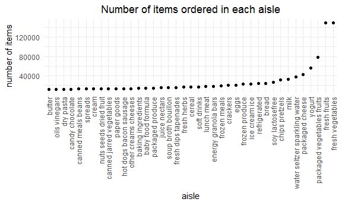
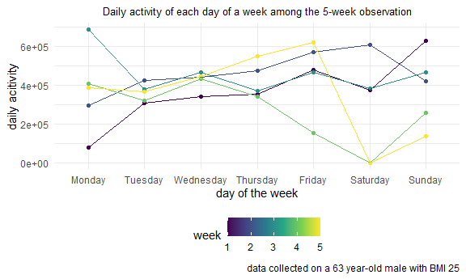
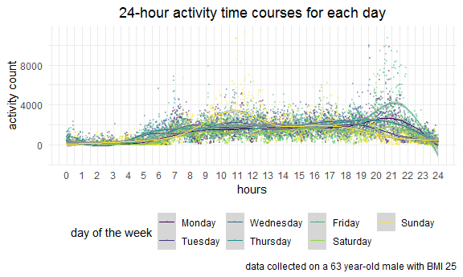

p8105\_hw3\_wc2750
================
Weixi Chen
10/9/2020

## Problem 1

Load instacart dataset

``` r
library(p8105.datasets)
data("instacart")
```

This dataset contains 1384617 rows and 15 columns.

Observations are the level of items in orders by user. There are user /
order variables – user ID, order ID, order day, and order hour. There
are also item variables – name, aisle, department, and some numeric
codes.

How many aisles, and which are most items from?

``` r
instacart %>%
  count(aisle) %>%
  arrange(desc(n))
```

    ## # A tibble: 134 x 2
    ##    aisle                              n
    ##    <chr>                          <int>
    ##  1 fresh vegetables              150609
    ##  2 fresh fruits                  150473
    ##  3 packaged vegetables fruits     78493
    ##  4 yogurt                         55240
    ##  5 packaged cheese                41699
    ##  6 water seltzer sparkling water  36617
    ##  7 milk                           32644
    ##  8 chips pretzels                 31269
    ##  9 soy lactosefree                26240
    ## 10 bread                          23635
    ## # ... with 124 more rows

Let’s make a plot

``` r
instacart %>%
  count(aisle) %>%
  filter(n > 10000) %>%
  mutate(
    aisle = factor(aisle),
    aisle = fct_reorder(aisle, n)
  ) %>%
  ggplot(aes(x= aisle, y = n)) +
  geom_point() +
  theme(axis.text.x = element_text(angle = 90, vjust = 0.5, hjust = 1))
```



Let’s make a table

``` r
instacart %>%
  filter(aisle %in% c("baking ingredients", "dog food care", "packaged vegetables fruits")) %>%
  group_by(aisle) %>%
  count(product_name) %>%
  mutate(rank = min_rank(desc(n))) %>%
  filter(rank <4) %>%
  arrange(aisle, rank) %>%
  knitr::kable()
```

| aisle                      | product\_name                                 |    n | rank |
| :------------------------- | :-------------------------------------------- | ---: | ---: |
| baking ingredients         | Light Brown Sugar                             |  499 |    1 |
| baking ingredients         | Pure Baking Soda                              |  387 |    2 |
| baking ingredients         | Cane Sugar                                    |  336 |    3 |
| dog food care              | Snack Sticks Chicken & Rice Recipe Dog Treats |   30 |    1 |
| dog food care              | Organix Chicken & Brown Rice Recipe           |   28 |    2 |
| dog food care              | Small Dog Biscuits                            |   26 |    3 |
| packaged vegetables fruits | Organic Baby Spinach                          | 9784 |    1 |
| packaged vegetables fruits | Organic Raspberries                           | 5546 |    2 |
| packaged vegetables fruits | Organic Blueberries                           | 4966 |    3 |

Apple vs ice cream

``` r
instacart %>%
  filter(product_name %in% c("Pink Lady Apples", "Coffee Ice Cream")) %>%
  group_by(product_name, order_dow) %>%
  summarize(mean_hour = mean(order_hour_of_day)) %>%
  pivot_wider(
    names_from = order_dow,
    values_from = mean_hour
  )
```

    ## `summarise()` regrouping output by 'product_name' (override with `.groups` argument)

    ## # A tibble: 2 x 8
    ## # Groups:   product_name [2]
    ##   product_name       `0`   `1`   `2`   `3`   `4`   `5`   `6`
    ##   <chr>            <dbl> <dbl> <dbl> <dbl> <dbl> <dbl> <dbl>
    ## 1 Coffee Ice Cream  13.8  14.3  15.4  15.3  15.2  12.3  13.8
    ## 2 Pink Lady Apples  13.4  11.4  11.7  14.2  11.6  12.8  11.9

## Problem 2

### Part 1

Import and tidy accel\_data

``` r
accel_df = read_csv("./data/accel_data.csv") %>%
  janitor::clean_names() %>%
  pivot_longer(
    cols = starts_with("activity_"),
    names_to = "minute",
    names_prefix = "activity_",
    values_to = "activity_count"
  ) %>%
  # include a weekday vs weekend variable
  mutate (
    weekday_vs_weekend = ifelse(day %in% c("Saturday", "Sunday"), "weekend", "weekday")
  ) %>%
  # encode data with reasonable variable classes
  mutate(
    week = as.integer(week),
    day_id = as.integer(day_id),
    day = ordered(as.factor(day), levels=c("Monday", "Tuesday", "Wednesday", "Thursday", "Friday", "Saturday", "Sunday")),
    minute = as.integer(minute),
    weekday_vs_weekend = as.factor(weekday_vs_weekend)
  ) %>%
  # arrange in reasonable order and organize variables
  arrange(week,day,minute) %>%
  relocate(week, day_id, day, weekday_vs_weekend)

# preview accel_df
accel_df
```

    ## # A tibble: 50,400 x 6
    ##     week day_id day    weekday_vs_weekend minute activity_count
    ##    <int>  <int> <ord>  <fct>               <int>          <dbl>
    ##  1     1      2 Monday weekday                 1              1
    ##  2     1      2 Monday weekday                 2              1
    ##  3     1      2 Monday weekday                 3              1
    ##  4     1      2 Monday weekday                 4              1
    ##  5     1      2 Monday weekday                 5              1
    ##  6     1      2 Monday weekday                 6              1
    ##  7     1      2 Monday weekday                 7              1
    ##  8     1      2 Monday weekday                 8              1
    ##  9     1      2 Monday weekday                 9              1
    ## 10     1      2 Monday weekday                10              1
    ## # ... with 50,390 more rows

The accel\_df has 50400 rows and 6 columns. The observation data is
collected from 5 weeks and 35 days. The day variable indicates the day
of the week. The added weekday\_vs\_weekend variable specifies whether
that day is weekday or weekend. The minute variable ranges from 1 to
1440. The activity\_counts variable indicates the activity counts for
each minute.

### Part 2

Total acitivity over the day

``` r
# table for aggregate daily activity counts
accel_df %>%
  group_by(day_id) %>%
  summarize(daily_activity = sum(activity_count))
```

    ## # A tibble: 35 x 2
    ##    day_id daily_activity
    ##     <int>          <dbl>
    ##  1      1        480543.
    ##  2      2         78828.
    ##  3      3        376254 
    ##  4      4        631105 
    ##  5      5        355924.
    ##  6      6        307094.
    ##  7      7        340115.
    ##  8      8        568839 
    ##  9      9        295431 
    ## 10     10        607175 
    ## # ... with 25 more rows

``` r
# table more easier to read
accel_df %>%
  group_by(week,day) %>%
  summarize(daily_activity = sum(activity_count)) %>%
  pivot_wider(
    names_from = day,
    values_from = daily_activity
  )
```

    ## # A tibble: 5 x 8
    ## # Groups:   week [5]
    ##    week  Monday Tuesday Wednesday Thursday  Friday Saturday Sunday
    ##   <int>   <dbl>   <dbl>     <dbl>    <dbl>   <dbl>    <dbl>  <dbl>
    ## 1     1  78828. 307094.   340115.  355924. 480543.   376254 631105
    ## 2     2 295431  423245    440962   474048  568839    607175 422018
    ## 3     3 685910  381507    468869   371230  467420    382928 467052
    ## 4     4 409450  319568    434460   340291  154049      1440 260617
    ## 5     5 389080  367824    445366   549658  620860      1440 138421

Visualize the trends

``` r
accel_df %>%
  group_by(week,day) %>%
  summarize(daily_activity = sum(activity_count)) %>%
  ggplot(aes(x = day, y = daily_activity, group = week, color = week)) +
  geom_point() +
  geom_line() +
  labs(x = "day of the week", y = "daily acitivity", title = "Daily activity of each day of a week among the 5-week observation", caption = "data collected on a 63 year-old male with BMI 25") +
  theme(plot.title = element_text(size = 10, hjust = 0.5))
```



For week 1,2, and 5, the activity count of the observed subject is
gradually increasing through the weekdays. For week 3, the subject has
the maximum activity on Monday and then keeps a stable amount of
activity in the following days. For week 4, the activity count keeps
stable from Monday to Wednesday but decreases after Wednesday. For week
1, 2, and 3, the activity count during weekends is close to the count on
the same week’s Friday. For week 4 and 5, the subject has nearly zero
amount of activity on Saturday and relatively lower amount on Sunday.

### Part 3

Make a single-panel plot that shows the 24-hour activity time courses
for each day and use color to indicate day of the week

``` r
accel_df %>%
  group_by(day, minute) %>%
  summarize(weekday_activity = sum(activity_count)) %>%
  ggplot(aes(x = minute, y = weekday_activity, color = day)) +
  geom_point(alpha = .5, size = .5) +
  geom_smooth() +
  labs(x= "hours", y= "activity count", title = "24-hour activity time courses for each day", caption = "data collected on a 63 year-old male with BMI 25") +
  scale_x_continuous(
    breaks = c(seq(0, 1440, by = 60)),
    labels = c(seq(0, 24, by = 1))) +
  theme(plot.title = element_text(hjust = 0.5))
```



The observed subject might sleep around 11:30PM and get up around 5AM.
He has relatively higher amount of activity from 10AM to 12PM on Sunday
and from 8PM to 10PM on Friday. For the rest of the time, his activity
amount keeps stable.
